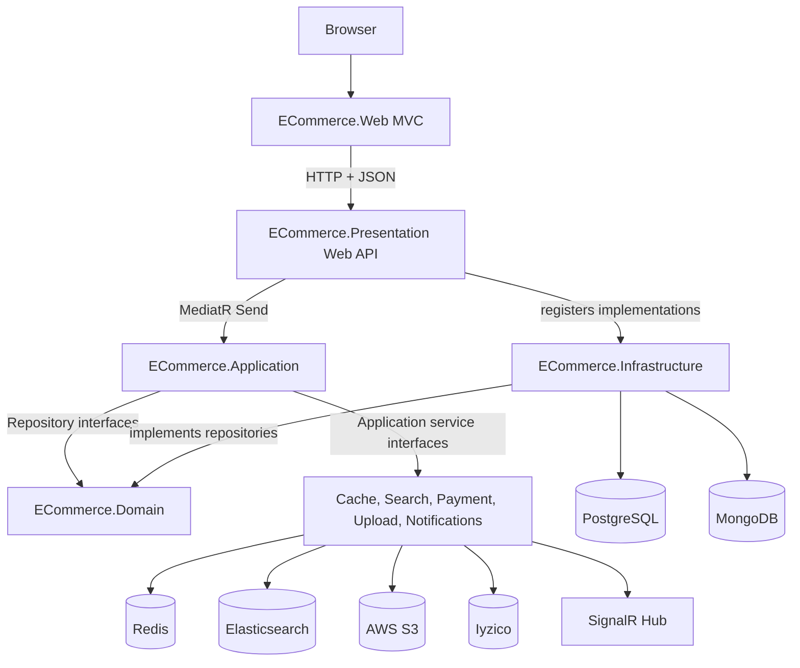

# Desired Architecture

This document explains the architecture used in this repository and the reason behind the main architectural decisions.

The solution is a .NET 10 e-commerce system built around a Clean Architecture style. The code is split into independent projects so the core business rules are not tied directly to ASP.NET Core, databases, cache providers, search engines, or UI concerns.

## Solution Structure

```text
dotnet-ecommerce
|-- ECommerce.Domain          # Core entities and repository contracts
|-- ECommerce.Application     # Use cases, CQRS handlers, validation, service abstractions
|-- ECommerce.Infrastructure  # Database contexts, repository implementations, persistence adapters
|-- ECommerce.Presentation    # ASP.NET Core Web API host
|-- ECommerce.Web             # ASP.NET Core MVC frontend that calls the API
`-- ECommerce.Shared          # DTOs, constants, enums, and Result wrappers shared across boundaries
```

## High-Level Architecture



The dependency direction is intentionally inward:

```text
Presentation/API -> Application -> Domain
Presentation/API -> Infrastructure -> Domain
Web MVC -> Shared + external API calls
Shared -> no project-specific dependency
```

`ECommerce.Presentation` is the composition root. It wires together the application layer, infrastructure implementations, middleware, authentication, authorization, Redis, Elasticsearch, SignalR, Swagger, health checks, and other host-level concerns.

## Layer Responsibilities

### ECommerce.Domain

The Domain project contains the core model and persistence contracts:

- Entities such as `Product`, `Category`, `Order`, `BasketItem`, `WishlistItem`, `Notification`, `RefreshToken`, and `User`.
- Repository interfaces such as `IProductRepository`, `IOrderRepository`, `IUserRepository`, and `ICategoryRepository`.
- Unit of work contracts such as `IUnitOfWork`, `IStoreUnitOfWork`, and `ICrossContextUnitOfWork`.

Reason for this decision:

The domain model and contracts sit at the center of the system. Keeping them separate makes business concepts available to application use cases without forcing those use cases to depend on EF Core, MongoDB, ASP.NET Core controllers, or other infrastructure details.

### ECommerce.Application

The Application project contains the business use cases and orchestration logic:

- Commands for write operations, for example `CreateProductCommand`, `LoginCommand`, `CreateOrderCommand`, and `UpdateProfileCommand`.
- Queries for read operations, for example `GetAllProductsQuery`, `GetProductByIdQuery`, and `GetUserOrdersQuery`.
- MediatR handlers that execute use cases.
- FluentValidation validators and a MediatR validation pipeline behavior.
- Application service abstractions such as `ICacheService`, `IElasticSearchService`, `IPaymentService`, `IFileUploadService`, `INotificationService`, `ICurrentUserService`, and `ILogService`.
- Concrete application services for cache, search, payment, uploads, notifications, logging, locking, and current-user access.

Reason for this decision:

The Application layer is where business workflows are coordinated. Controllers remain thin because they only translate HTTP requests into commands or queries. This keeps request handling consistent and makes use cases easier to test, reason about, and change.

### ECommerce.Infrastructure

The Infrastructure project contains external persistence implementation details:

- `StoreDbContext` for store data handled with EF Core and PostgreSQL.
- `IdentityDbContext` for ASP.NET Core Identity data.
- `MongoDbContext` for document collections.
- Repository implementations such as `ProductRepository`, `OrderRepository`, `BasketItemRepository`, `CategoryRepository`, and `RefreshTokenRepository`.
- Unit of work implementations for EF-backed operations and cross-context operations.

Reason for this decision:

Infrastructure changes more often than business rules. Keeping database contexts and concrete repositories outside the Domain and Application projects lets the system swap or adjust persistence details without rewriting the use cases that depend on repository contracts.

### ECommerce.Presentation

The Presentation project is the Web API host:

- Defines API controllers.
- Configures JWT authentication and role-based authorization.
- Registers dependencies from Application, Infrastructure, and validation.
- Configures middleware for exception handling, security headers, rate limiting, response compression, CORS, Swagger, health checks, and request logging.
- Maps the SignalR notification hub.
- Initializes roles and seeds the database at startup.

Reason for this decision:

The API host is responsible for transport and runtime configuration. It owns HTTP-specific behavior and dependency composition, while business logic stays in Application handlers.

### ECommerce.Web

The Web project is an ASP.NET Core MVC frontend:

- Renders views and handles user-facing form flows.
- Uses typed `HttpClient` services to call the API.
- Stores the access token in session after login.
- Adds the bearer token to outgoing API requests through `AuthTokenHandler`.
- Depends on `ECommerce.Shared` for shared DTOs and result contracts.

Reason for this decision:

Separating the MVC frontend from the API makes the backend usable by other clients later, such as a SPA, mobile app, or partner integration. The MVC project does not reach into repositories or application handlers directly; it consumes the backend through the same HTTP boundary as any external client.

### ECommerce.Shared

The Shared project contains cross-boundary types:

- Request DTOs.
- Response DTOs.
- Constants and error messages.
- Enums.
- `Result` and `Result<T>` wrappers.

Reason for this decision:

DTOs and response contracts are used by both the API and MVC client. Placing them in a shared project avoids duplicating transport models while keeping them separate from domain entities.

## Request Flow

### API Request Flow

Most API requests follow this path:

```text
HTTP request
-> API controller
-> MediatR command/query
-> FluentValidation pipeline
-> Application handler
-> Repository/service abstraction
-> Infrastructure or external service
-> Result / Result<T>
-> API response
```

Example: product creation

```text
ProductController.CreateProduct
-> CreateProductCommand
-> CreateProductCommandHandler
-> validates category and duplicate product name
-> updates cache/search concerns
-> ProductRepository.Create
-> UnitOfWork.Commit
-> Result.Success
```

Reason for this decision:

This flow gives every feature a predictable shape. Controllers are small, validation is centralized, business logic is in handlers, and persistence is accessed through interfaces.

### MVC Request Flow

The MVC frontend follows a separate client flow:

```text
Browser
-> MVC controller
-> typed API service
-> AuthTokenHandler adds bearer token from session
-> Web API
-> MVC view model and Razor view
```

Reason for this decision:

The MVC app behaves like a real API client. This avoids coupling the UI to internal server implementation details and keeps the API contract honest.

## Main Architectural Decisions

### Clean Architecture Project Split

Decision:

The solution is split into Domain, Application, Infrastructure, Presentation, Web, and Shared projects.

Reason:

This keeps responsibilities separate. Domain and Application code can evolve around business behavior, while Presentation and Infrastructure can change around frameworks, hosting, databases, and external services.

Tradeoff:

There are more projects and more explicit interfaces than in a small monolithic MVC app. The extra structure is useful here because the system already has authentication, payments, caching, search, notifications, multiple databases, and two presentation surfaces.

### CQRS with MediatR

Decision:

Use commands for writes and queries for reads, dispatched through MediatR.

Reason:

E-commerce operations have different read and write concerns. Reads benefit from caching and search optimization, while writes often need validation, transactions, cache invalidation, indexing, and notifications. CQRS gives each operation a focused handler instead of concentrating logic in controllers or large service classes.

Tradeoff:

Simple CRUD operations require more files. The benefit is clearer use-case boundaries as the application grows.

### Thin Controllers

Decision:

Controllers delegate work to MediatR and return standardized results through `ApiBaseController`.

Reason:

Controllers should manage HTTP concerns: routing, authorization, binding, and response conversion. Business decisions live in Application handlers, where they are easier to reuse and test.

Tradeoff:

Understanding a request requires navigating from controller to command/query handler. The consistent naming convention keeps that navigation predictable.

### Repository Pattern

Decision:

The Domain layer defines repository interfaces and Infrastructure implements them.

Reason:

Use cases should depend on business-facing data access contracts, not on EF Core, MongoDB driver APIs, or database-specific query code. This keeps persistence details isolated and supports the mixed database strategy.

Tradeoff:

Repositories add an abstraction layer. The abstraction is justified because the project uses more than one persistence technology and needs a stable application-facing contract.

### Unit of Work

Decision:

Use unit of work abstractions for committing EF Core changes and coordinating transactions.

Reason:

Operations such as account, order, basket, and token changes may touch multiple repositories. A unit of work gives handlers explicit control over when changes are committed.

Tradeoff:

MongoDB repository operations are committed directly by the Mongo driver, while EF Core operations are committed through `SaveChangesAsync`. This means transactional guarantees differ by storage technology and should be considered when designing workflows that cross databases.

### Polyglot Persistence

Decision:

Use PostgreSQL with EF Core for relational and identity-backed data, and MongoDB for document-style catalog data.

Reason:

User identity, roles, baskets, and orders fit relational storage and EF Core transaction semantics. Product and category catalog data can be handled as documents, which fits flexible catalog reads and indexing patterns.

Tradeoff:

Using two database models increases operational complexity. The code offsets this by hiding each database behind repository interfaces.

### ASP.NET Core Identity

Decision:

Use ASP.NET Core Identity with `User : IdentityUser<Guid>`.

Reason:

Identity provides proven password hashing, role management, token providers, and user stores. The project extends the built-in user model with profile, consent, address, and ban fields instead of building authentication storage from scratch.

Tradeoff:

The domain user model is coupled to Identity's base type. This is acceptable here because authentication and account management are central to the application and the API already uses Identity directly.

### JWT Authentication and Role Policies

Decision:

Use JWT bearer authentication with `User` and `Admin` authorization policies.

Reason:

The backend is an API consumed by the MVC frontend and potentially other clients. JWTs work well for stateless API authorization, while role policies keep endpoint protection declarative.

Tradeoff:

Token lifetime, refresh token handling, and session storage in the MVC app must be managed carefully. The current MVC frontend stores the access token in server-side session and forwards it through a delegating handler.

### Result Pattern

Decision:

Use `Result` and `Result<T>` for expected success/failure outcomes.

Reason:

Handlers can return predictable responses without throwing exceptions for normal business failures such as duplicate products, invalid credentials, or missing records.

Tradeoff:

The current wrapper is intentionally simple. It carries a success flag, optional data, and one message, but does not model rich error codes or multiple validation errors.

### FluentValidation Pipeline

Decision:

Register validators and execute them through a MediatR pipeline behavior.

Reason:

Validation runs before handlers, so handlers can focus on use-case orchestration. The same validation mechanism applies to every command or query that has a validator.

Tradeoff:

Validation exceptions are handled by API middleware, so validation response shape depends on middleware behavior rather than each individual controller action.

### Centralized Exception Middleware

Decision:

Use `GlobalExceptionMiddleware` in the API pipeline.

Reason:

Unexpected exceptions and validation exceptions are converted into JSON responses in one place. This prevents repeated try/catch response logic in controllers.

Tradeoff:

Application handlers still catch many exceptions and convert them into failed `Result` values. That means error handling is split between expected handler failures and unexpected middleware-level failures.

### Redis Caching

Decision:

Use Redis for distributed caching through `ICacheService`.

Reason:

Catalog reads are common in e-commerce. Caching product query responses reduces repeated database access and improves response times.

Tradeoff:

Write handlers must invalidate or update cache keys. For example, product creation removes the product cache before inserting and indexing the product.

### Elasticsearch Search

Decision:

Use Elasticsearch for product search and maintain product indexes from application handlers.

Reason:

Search requirements often outgrow database filtering. Elasticsearch supports text search and scalable catalog discovery without forcing the main product repository to become a search engine abstraction.

Tradeoff:

The application must keep MongoDB and Elasticsearch synchronized. Handlers that mutate searchable data need to update both persistence and index state.

### SignalR Notifications

Decision:

Use SignalR for real-time notifications through `NotificationHub` and notification services.

Reason:

Events such as payment success or order updates are user-facing and benefit from live delivery. SignalR gives the API a real-time channel alongside REST endpoints.

Tradeoff:

Real-time connections require additional authentication handling. The API explicitly reads bearer tokens from the `access_token` query string for `/notificationHub`.

### AWS S3 File Uploads

Decision:

Use AWS S3 for file storage through an application upload service.

Reason:

Product images and uploaded files should not be stored in the web server filesystem. Object storage is more scalable and better suited to cloud deployment.

Tradeoff:

The API depends on environment-based AWS configuration and must handle cloud credentials securely.

### Iyzico Payment Integration

Decision:

Use Iyzico for payment processing behind `IPaymentService`.

Reason:

Payment processing is a specialized external concern. Encapsulating it behind a service keeps order use cases from depending directly on provider-specific request construction.

Tradeoff:

Provider-specific concepts still appear inside `PaymentService`. Replacing the provider would mostly affect that service and the payment abstraction rather than controllers.

### API Versioning

Decision:

Enable API versioning through URL segments, headers, and query strings.

Reason:

API consumers need a stable contract. Versioning allows the backend to evolve without breaking existing clients immediately.

Tradeoff:

Supporting multiple version readers increases API surface complexity. The benefit is client flexibility during development and migration.

### Rate Limiting

Decision:

Apply global rate limiting and stricter authentication limits.

Reason:

Authentication and public API endpoints are common abuse targets. Rate limiting protects backend resources and reduces brute-force pressure.

Tradeoff:

Limits must be tuned for real traffic. Development defaults may need adjustment for production workloads.

### Health Checks

Decision:

Expose `/health` with PostgreSQL and Redis checks.

Reason:

Health checks support operational monitoring and container orchestration. They verify that critical dependencies are reachable.

Tradeoff:

Only registered checks are covered. MongoDB, Elasticsearch, S3, and payment-provider health are not included in the current health-check setup.

### Docker Compose for Local Services

Decision:

Use Docker Compose for Redis, Elasticsearch, and Kibana.

Reason:

Local development requires supporting infrastructure. Docker Compose provides repeatable service startup without requiring every developer to install these services directly.

Tradeoff:

The compose file does not currently define PostgreSQL or MongoDB, so those must be provided separately.

## Cross-Cutting Concerns

### Logging

The API configures Serilog with console and rolling file sinks. Logs include request timing and diagnostic context such as host, scheme, and user agent.

Reason:

Centralized structured logging makes API behavior easier to diagnose in development and production.

### Security Headers

The API adds headers such as Content Security Policy, HSTS, `X-Content-Type-Options`, `X-Frame-Options`, Referrer Policy, and Permissions Policy.

Reason:

These defaults reduce common browser-facing security risks for API and real-time endpoints.

### Response Compression

The API enables Brotli and Gzip compression.

Reason:

Compression reduces response size and improves API performance for clients, especially over slower networks.

### Environment Configuration

The API loads required settings from `.env` and environment variables.

Reason:

Secrets and deployment-specific settings should not be hard-coded. Startup validation fails fast when required variables are missing.

Tradeoff:

Local development depends on a complete `.env` file. Missing variables stop the application at startup by design.

## Data and Integration Map

| Concern                        | Main location                               | Technology                         |
| ------------------------------ | ------------------------------------------- | ---------------------------------- |
| Users and roles                | `IdentityDbContext`                         | ASP.NET Core Identity + PostgreSQL |
| Orders and basket data         | `StoreDbContext`                            | EF Core + PostgreSQL               |
| Products and catalog-like data | Mongo repositories                          | MongoDB                            |
| Cached query data              | `ICacheService` / `CacheService`            | Redis                              |
| Product search                 | `IElasticSearchService` / descriptors       | Elasticsearch                      |
| Real-time notifications        | `NotificationHub` and notification services | SignalR                            |
| File uploads                   | `IFileUploadService` / upload service       | AWS S3                             |
| Payments                       | `IPaymentService` / `PaymentService`        | Iyzico                             |
| API client UI                  | `ECommerce.Web` services                    | Typed `HttpClient`                 |

## Current Architectural Notes

- `IMessageBroker` exists as an application abstraction, and `RABBITMQ_CONNECTION` is required during dependency registration, but no concrete message broker registration is visible in the current tree.
- The README mentions full Docker startup, but the current `docker-compose.yml` defines Redis, Elasticsearch, and Kibana only. PostgreSQL and MongoDB must be supplied separately unless another compose file is added later.
- `ECommerce.Presentation` is named as the API project in the solution, while the README uses `ECommerce.API` in examples. The project file sets `RootNamespace` to `ECommerce.API`.
- Some application services call external provider SDKs directly from the Application project. This keeps the use cases close to integrations, but it also means Application has package references to provider SDKs. A stricter Clean Architecture variant would move provider-specific implementations into Infrastructure.

## How to Add a New Feature

Use this path for most new API features:

1. Add or update Domain entities and repository contracts if the core model changes.
2. Add request/response DTOs in `ECommerce.Shared` if the API contract changes.
3. Add a command or query in `ECommerce.Application`.
4. Add a handler that uses Domain repository interfaces and Application service abstractions.
5. Add a FluentValidation validator when request validation is needed.
6. Implement repository or external-service details in `ECommerce.Infrastructure` when needed.
7. Register new services in the appropriate dependency extension.
8. Add or update an API controller endpoint that sends the command/query through MediatR.
9. Add or update MVC API client methods and views if the feature is exposed in `ECommerce.Web`.

This keeps new behavior aligned with the existing dependency direction and avoids pushing business logic into controllers, views, or persistence classes.
